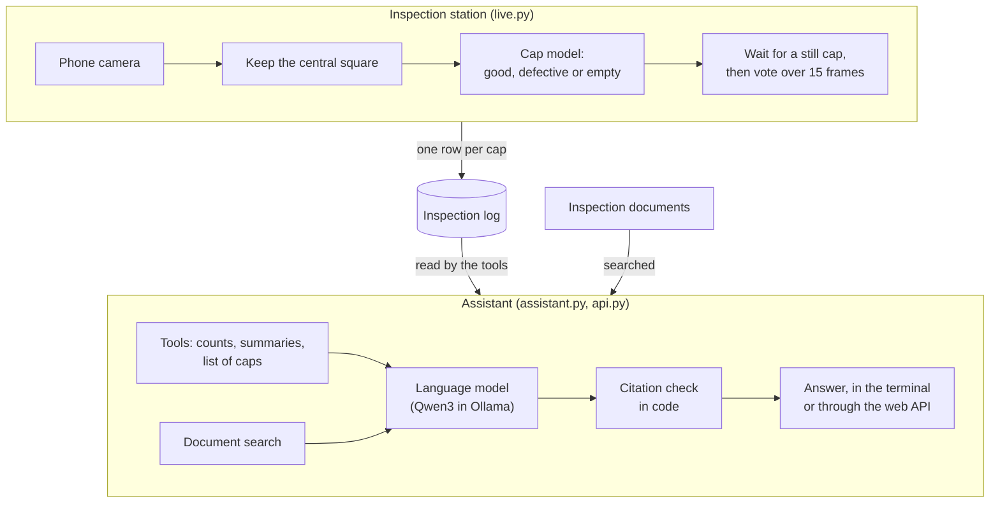

# AI Inspection Assistant

[](https://github.com/ToumiFaycal/ai-inspection-assistant/actions/workflows/tests.yml)

A small quality-inspection station made from a phone, a lamp and a cardboard box. A camera checks bottle caps one at a time and sorts each one as good or defective. Every decision is saved, and an AI assistant answers questions about those decisions and about the inspection rules. Everything runs on one laptop.

<!-- Demo GIF goes here: the station checking caps, then the assistant answering a question. -->

## What it does

1. **Sees.** A phone above the inspection spot streams video to the laptop.
2. **Decides.** An image model trained on my own photos looks at each video frame and answers `good`, `defective` or `empty` (nothing on the spot). The station waits until the cap is still and the answers agree, then makes one decision per cap. If it can't make up its mind, it rejects the cap to be safe.
3. **Remembers.** Every decision goes into the inspection log with its time, the answer and how sure the station was.
4. **Answers.** You can ask the assistant questions in plain words, such as *"What was the defect rate yesterday, and what counts as a scratch?"* It takes the numbers from the inspection log and the rules from the inspection documents, and says which document each rule comes from.

No paid service is used and nothing is sent to the internet: the AI models run on the laptop.

## Results

Every number below comes from running the code in this repository.

**Cap model.** The final test used 65 photos of caps the model had never seen. They were kept aside until the very end and never used to tune anything.

| Question | Result |
|---|---|
| How often was the answer right? | 63 of 65 photos (96.9%) |
| How many of the 25 defective photos were caught? | 23 (92%) |
| How many of the 25 good photos were wrongly rejected? | 0 |
| How many of the 15 empty photos were recognised? | 15 |

Both misses are photos of the same cap, whose rim is only slightly bent. The other 3 photos of that cap were caught. In quality-control terms, the defective class has a recall of 92% (share of defective caps caught) and a precision of 100% (share of rejected caps that really were defective).

**Assistant.**
- **Exam.** 31 questions with known answers, graded automatically by code. They cover numbers from a demo log, rules from the documents, questions the documents don't answer, and off-topic questions. It got full marks on each of the 8 recorded runs.
- **Invented sources.** With instructions alone, the assistant invented a source in 10 of 20 answers. With checks in code, it invented none (0 of 20). The details are in *How it was built* below.

**Automated tests.** 33 tests run on GitHub after every change. The badge at the top shows whether they currently pass.

## How it works



**1. Camera and crop** ([camera.py](src/camera.py), [preprocess.py](src/preprocess.py)). An Android phone running the free IP Webcam app streams 1280x720 video over Wi-Fi. The station keeps only the central 720x720 square where the cap sits. The training photos were cropped the same way, so the model always sees the same kind of image.

**2. Cap model** ([train.py](src/train.py), [classifier.py](src/classifier.py)). The model is a small YOLO26 image classifier from Ultralytics. It was first trained by Ultralytics on ImageNet, a public collection of over a million everyday photos, and then retrained on my 336 cap photos (this is called fine-tuning). For each image it gives three probabilities: good, defective and empty. A cap counts as defective as soon as the defective probability reaches 40%, instead of waiting for "more likely than not". Letting a bad cap through is worse than a false alarm. The 40% was chosen on a separate set of practice photos and fixed before the final test.

**3. One decision per cap** ([cap_decider.py](src/cap_decider.py), [live.py](src/live.py)). The video gives many frames per second, and a single frame can be fooled, for example by a hand passing by. So the station:
- ignores frames while something is moving, found by comparing each frame with the one before;
- decides when 12 of the last 15 still frames agree;
- rejects the cap as "unsure", to be checked by hand, if 60 still frames go by without agreement;
- waits for the spot to be empty again before starting on the next cap.

**4. Inspection log** ([inspection_log.py](src/inspection_log.py)). This is a SQLite database, meaning a small database stored in a single file. It holds one row per cap:
- the time;
- the decision;
- a confidence: the share of the voting frames that agreed;
- the reason: a normal vote, or "unsure".

**5. Assistant** ([assistant.py](src/assistant.py), [assistant_tools.py](src/assistant_tools.py)). The assistant is built on Qwen3 8B, a language model (the kind of AI behind chatbots). It runs in Ollama, a free program that runs such models on your own computer. The model can't read the log or the documents itself. Instead it asks for *tools*: Python functions that do the lookup and the arithmetic and hand back the result. It has five tools:
- count all decisions;
- tell the date and time;
- summarise a period;
- list the caps of a period;
- search the documents.

The log is opened read-only, so the assistant can never change it.

**6. Document search** ([knowledge_base.py](src/knowledge_base.py), [knowledge/](knowledge/)). Four short documents describe the station: defect definitions, the inspection procedure, tuning notes and known limitations. They are split into 39 sections. A second, smaller model (EmbeddingGemma, from Google, also run by Ollama) turns each section into an *embedding*, a list of 768 numbers that describes its meaning. A question is turned into numbers the same way, and the 3 sections with the closest meaning are handed to the assistant. If no section is close enough (a score below 0.35), the search reports that nothing was found, so an off-topic question isn't answered from unrelated text. This way of answering from your own documents is called retrieval-augmented generation (RAG).

**7. Citation check** ([assistant.py](src/assistant.py)). Every rule taken from the documents must end with its source, for example `[Defect definitions > Scratches]`. After the assistant answers, the code checks the answer:
- If the assistant didn't look anything up, or cited a section that no search returned, the answer is thrown away. The assistant is then asked again, with the right sections given to it.
- Any citation that is still not backed by a search is removed.

**8. Web API** ([api.py](src/api.py)). An API lets other programs use the station over the network. It is built with FastAPI and has four addresses (endpoints):
- `/health`: is the server running?
- `/summary`: a summary of a period;
- `/caps`: the caps of a period;
- `/ask`: a question for the assistant.

FastAPI also builds a page where each endpoint can be tried from the browser.

**9. Tests and exam** ([tests/](tests/), [evaluate_assistant.py](src/evaluate_assistant.py)). The automated tests check each piece on small made-up examples. They run on GitHub after every push; this is called continuous integration, or CI. The assistant exam asks its 31 questions against a demo log built in a temporary folder, so the real log is never touched.

## How it was built: problems met and how they were fixed

**Training tricks that hid the defects.** The first model scored 58 of 60 on the practice photos. It called one black cap defective even in its good photos, and it was only about 75% sure when the spot was empty. The example pictures the training library saves, and its code, showed why. By default, it randomly zooms into part of each photo and blacks out random rectangles. These are common tricks to make a model more robust, but here they sometimes cut off or covered the very scratch that made a photo "defective". So the model was learning "defective" from photos where no defect was visible. With those two tricks turned off, it scored 60 of 60 and was fully sure on empty photos.

**A hand passing by fooled the model.** Checking single frames, I saw the answer flip when a hand was in view, usually from good to defective. So I made the station vote over 15 frames, 12 of which must agree. Then slow placements were decided before the cap was in place, so a stillness check was added, and I tuned its threshold by moving caps under the camera. Last came the question of what to do if the frames never agree. The answer: reject the cap after 60 still frames and mark it "unsure" (when in doubt, reject).

**The language model made things up.** On its own, the language model confidently described a cap's tamper ring (the ring that breaks when a bottle is first opened) as "a small metal ring". It is plastic. It also admitted, rightly, that it couldn't know how many defective caps there had been. That is why the assistant takes its numbers only from tools and its rules only from the documents.

**"When exactly were the caps tested yesterday?"** I asked this while testing the assistant, and it revealed a hidden problem. The summary tool also returned the time window it had been asked about, and the assistant read that window as the testing times. It answered "from 00:00 to 23:59:59", when the caps had really been tested between 16:53:58 and 16:55:51. The fix had three parts:
- gave the window clearer names (`period_start`, `period_end`);
- added the real first and last inspection times;
- added a new tool that lists each cap with its time.

The lesson: the names in a tool's results are all the model has to understand them, so choosing clear names is part of the design.

**Invented sources.** At first, the prompt only told the assistant to search the documents and cite them. On 20 questions answered by the documents, it skipped the search 12 times and invented a source 10 times, for example `[Integration > Factory Use]`, a section that doesn't exist. Three fixes were tried and measured:
- Always giving it the search results first: the document answers were right, but it stopped using its log tools and got 0 of 12 log questions right.
- Attaching the sections to the question: 6 of 12 log questions right.
- **Letting it answer, then checking the answer in code** (kept): 12 of 12 log questions right, all 20 document answers cited, and no invented sources.

The lesson: an instruction in the prompt is a request, not a guarantee. Anything that must be true has to be checked in code.

## Known limitations

- **Dark caps with thin scratches.** A dark brown, grainy cap was still called good, with full confidence, after it was scratched. No cap like it was in the training photos.
- **Subtle rim defects.** Both misses in the final test were a rim that was only slightly bent.
- **Only the top is seen.** Damage on the side or underneath (tamper ring, threads, inside) can't be detected.
- **The setup must not change.** The model knows one camera position, one lamp and no daylight. The phone's automatic colour adjustment can also tint the picture.
- **A small dataset.** 336 photos of about 28 caps, mostly blue and red. The practice photos had mostly obvious defects, so the 40% threshold was chosen on easier photos than the final test.
- **An exam written by its builders.** The exam questions were written while building the assistant, by people who knew how it works. Full marks show that it does what it was designed to do, not that it will handle any question. Answers can also vary from one run to the next.
- **A learning project, not a product.** It shows how the pieces of an inspection system fit together. It is not meant for a real factory.

The full list is in [knowledge/known_limitations.md](knowledge/known_limitations.md). It is one of the documents the assistant answers from, so you can also ask the assistant about its own limits.

## Try it yourself

This project was built and tested on Windows with Python 3.14 and an NVIDIA GPU. The photos and the trained model are not in this repository. A model trained in my cardboard box, under my lamp, wouldn't work well under another camera anyway.

**Install** (in PowerShell, from the project folder):

```powershell
python -m venv .venv
.venv\Scripts\Activate.ps1
python -m pip install torch==2.14.0 torchvision==0.29.0 --index-url https://download.pytorch.org/whl/cu130
python -m pip install -r requirements.txt
```

The third line installs the GPU version of PyTorch, the library the image model runs on. On Windows, a plain install gives the slower CPU-only version.

**Run the tests** (no camera and no AI models needed):

```powershell
python -m pytest
```

**Run the assistant.** First install [Ollama](https://ollama.com/download), then download the two models:

```powershell
ollama pull qwen3:8b
ollama pull embeddinggemma
```

- `python src/evaluate_assistant.py` gives the assistant its exam, using a demo log. It takes a few minutes.
- `python src/assistant.py` lets you chat with the assistant in the terminal. Questions about the log need a real inspection log, which the station creates.
- `python src/api.py` starts the web API. Then open http://127.0.0.1:8000/docs in a browser.

**Build your own station.** Put your camera's address in [camera.py](src/camera.py), then:
1. [capture.py](src/capture.py): take the photos, one key per class (set `SPLIT` at the top of the file before each photo session). Photograph each physical cap in only one set (training, practice or test), so the final test only uses caps the model has never seen.
2. [preprocess.py](src/preprocess.py): crop the photos.
3. [train.py](src/train.py): train the model.
4. [evaluate.py](src/evaluate.py): measure the model.
5. [live.py](src/live.py): run the station.

## Project layout

```
src/                 the code, one file per piece; each file starts with a plain explanation
knowledge/           the inspection documents the assistant answers from
tests/               the automated tests
docs/references.md   the documentation I read while building this, and what each page was used for
.github/workflows/   the automatic test run on GitHub
```

## Credits

- [Qwen3](https://qwenlm.github.io/blog/qwen3/), the language model, by Alibaba's Qwen team.
- [EmbeddingGemma](https://ai.google.dev/gemma/docs/embeddinggemma), the document search model, by Google.
- Both run locally with [Ollama](https://ollama.com/download).
- [YOLO26](https://docs.ultralytics.com/models/yolo26/), the image model and its training library, by Ultralytics.
- OpenCV, SQLite, FastAPI and pytest, and everything listed in [docs/references.md](docs/references.md).
- Built with the help of Claude, Anthropic's AI assistant. Yes, AI tools deserve credit when they're used well, and there's no shame in saying so: they're meant to be used to make such projects possible.

## About me

I'm Faycal Toumi. I don't like GitHub projects that are hard to follow, or full of acronyms nobody explains, so I tried to make this one clear to anyone who reads it. I hope it worked. If you have a question or want to talk, reach out on [LinkedIn](https://www.linkedin.com/in/faycal-toumi/): I'll gladly reply.

This project is under the [MIT License](LICENSE).
